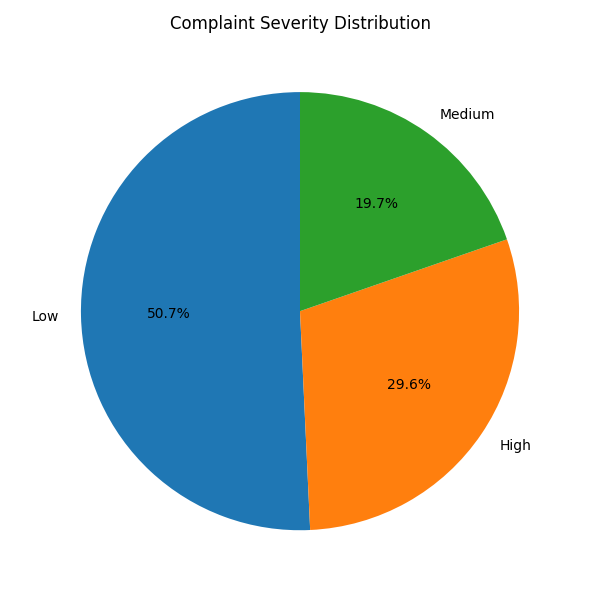
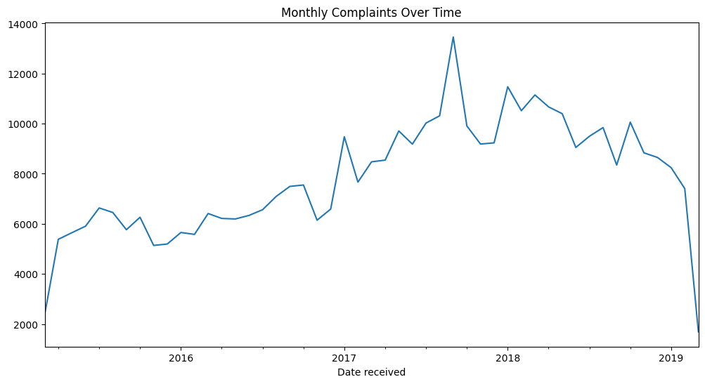
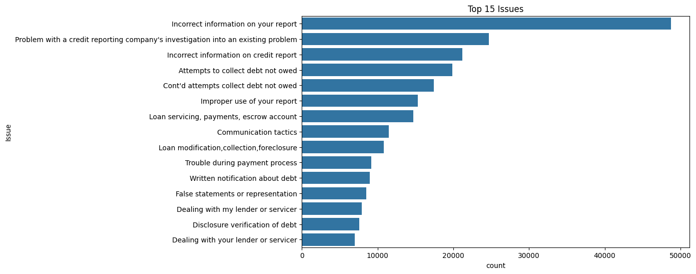
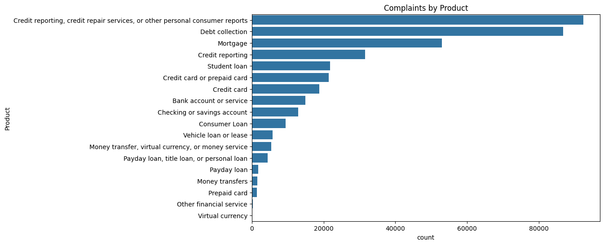
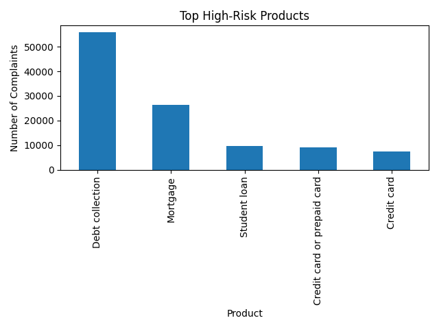

'''

# AI-Powered Consumer Complaint Risk & Severity Intelligence

<p align="center">
  
</p>

## 📌 Overview

An **AI-driven analytics platform** that transforms large-scale consumer complaint data into **risk intelligence** using **NLP, sentiment analysis, severity modeling, and interactive dashboards**.

The system processes **380,000+ consumer complaints**, identifies **high-risk issues and products**, and visualizes insights to support **business, compliance, and risk decision-making**.

---

## 🎯 Problem Statement

Organizations receive massive volumes of consumer complaints, but:

* Critical risks remain hidden in unstructured text
* Manual analysis is slow and error-prone
* Early warning signals are often missed

This project solves that using **AI-powered complaint intelligence**.

---

## ⚙️ Tech Stack

* **Language:** Python
* **Data Processing:** Pandas, NumPy
* **NLP & AI:** NLTK (VADER Sentiment Analysis)
* **Visualization:** Matplotlib, Plotly
* **Dashboard:** Streamlit

---

## 🔄 Project Workflow

1. **Data Ingestion & Cleaning**

   * Processed raw complaint data at scale using chunking
2. **Sentiment Intelligence**

   * NLP-based polarity detection on complaint narratives
3. **Risk & Severity Modeling**

   * Rule-based severity classification (Low / Medium / High)
4. **Advanced Analytics**

   * Risk trends, top issues, products, and companies
5. **Interactive Dashboard**

   * Business-ready visual insights using Streamlit

---

## 📊 Key Insights & Visuals

### 🔹 Complaint Severity Distribution

<p align="center">
  
</p>

---

### 🔹 Complaints Over Time

<p align="center">
  
</p>

---

### 🔹 Top Issues & Products

<p align="center">
  
</p>

<p align="center">
  
</p>

---

### 🔹 High-Risk Products

<p align="center">
  
</p>

---

## 🖥️ Interactive Dashboard (Streamlit)

The dashboard enables:

* Filtering by **product and issue**
* Severity-wise risk analysis
* Trend identification for proactive action
* Executive-ready insights for stakeholders

### ▶️ Run Locally

```bash
pip install -r requirements.txt
streamlit run app.py
```

---

## 📂 Repository Structure

* `analysis.py` – Exploratory analytics
* `data_cleaning.py` – Data preprocessing
* `sentiment_severity.py` – NLP & severity logic
* `classification.py` – Complaint classification
* `app.py` – Streamlit dashboard
* `requirements.txt` – Dependencies
* `.png files` – Generated insights & visuals

---

## ⚠️ Dataset Note

The repository includes a sample CSV file sufficient to run the app and test all functionality.

The full dataset (380K+ complaints) is not included due to size.

Included instead:

* Complete processing & modeling code
* Sample processed outputs
* Visual insights generated from full data

This mirrors **real-world enterprise data handling practices**.

---

## 💼 Business Value

* Enables **early risk detection**
* Supports **compliance & customer protection**
* Improves **decision-making with AI-driven insights**
* Demonstrates **scalable analytics on real-world data**

---

## 👤 Author

**Musarrat Nazia**
AI & Data Analytics | Risk & Business Intelligence

---

